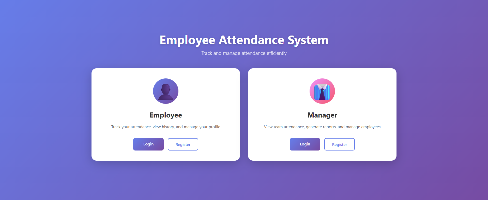
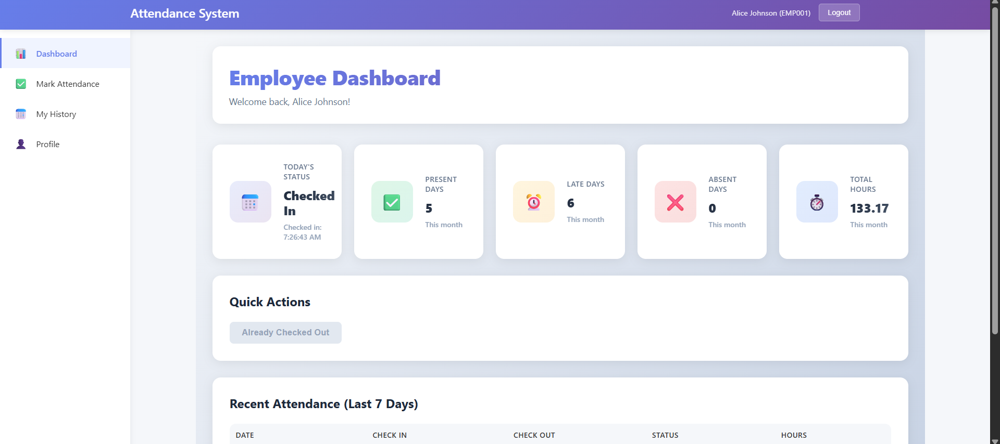
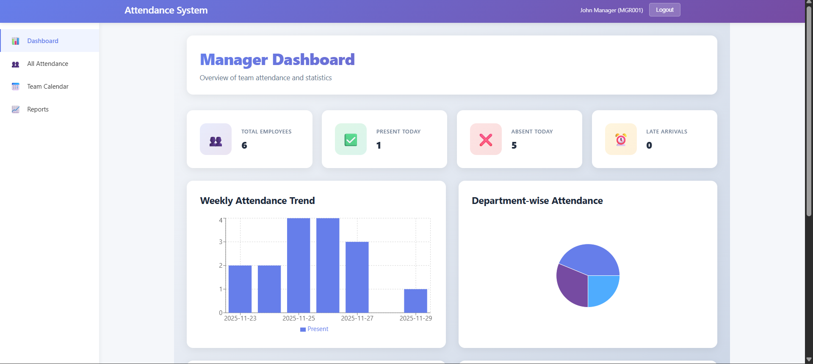
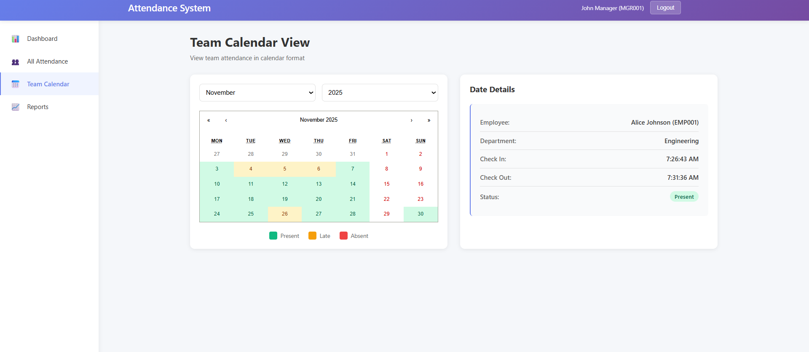
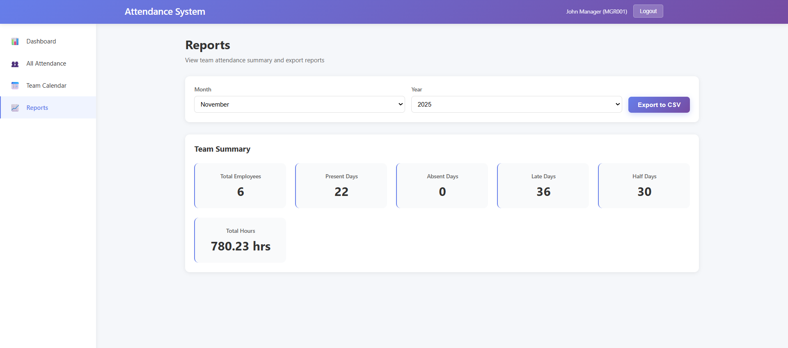
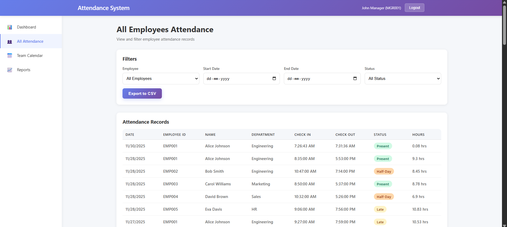

NAME:SHIVAHARIHARAN N
COLLEGE : SNS COLLEGE OF TECHNOLOGY
CONTACT : 9025173248 & shivahariharannagaraj@gmail.com

🚀 Employee Attendance Management System
A full-stack MERN application designed for companies to efficiently track daily employee attendance with separate dashboards for Employees and Managers.

# Default Login Credentials (After Seeding)

**Manager:**
Email: manager@company.com
Password: manager123

**Employee:**

Email: bob@company.com
Password:employee123

Email: carol@company.com
Password:employee123

Email: alice@company.com
Password: employee123

📌 Features
👨‍💼 Employee Features

Register & login
Check In / Check Out
View daily, weekly, and monthly attendance
Calendar view with color-coded status
Dashboard with analytics
Manage profile

🧑‍💼 Manager Features

Manager login
View all employees' attendance
Filter by employee, date, or status
Attendance summary and statistics
Weekly trends
Department-wise charts
Export reports as CSV

Tech Stack:
Frontend

React 18
Redux Toolkit
React Router
Recharts
React Calendar

Backend

Node.js
Express.js
MongoDB (Mongoose)
JWT Authentication

* Setup Instructions *
------------------------

Prerequisites:
Node.js (v14+)
MongoDB (Local or Atlas)
npm or yarn

-> Backend Setup :
------------------ 

Navigate to backend folder: `cd backend`
Install dependencies: `npm install`

Create a .env file inside /backend:

PORT=5000
MONGODB_URI=mongodb://localhost:27017/employee-attendance
JWT_SECRET=your_jwt_secret_here
NODE_ENV=development

Start backend server:
`npm run dev`
Backend runs at: http://localhost:5000

-> Frontend Setup :

Navigate to frontend: `cd frontend`
Install dependencies: `npm install`

Create .env file inside /frontend:

REACT_APP_API_URL=http://localhost:5000/api

Start the frontend:
`npm start`

Frontend runs at: http://localhost:3000

**SCREENSHOTS**:

